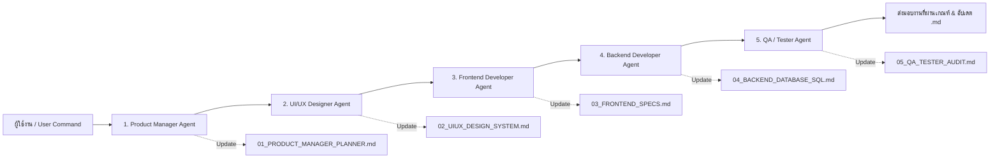

# 🤖 Book Sangdai - Multi-Agent Operating System & Living Documentation

ระบบศูนย์กลางข้อมูลสถาปัตยกรรม (Central Documentation Hub) สำหรับการทำงานของ **Multi-Agent 5 ตัว** ตามกฎเหล็ก **Global Routing Command**

---

## 🧭 กฎเหล็กและเวิร์กโฟลว์ของระบบ Multi-Agent (Global Rules)

1. **Pipeline Execution:** ทุกครั้งที่มีการสั่งงาน (Command) จากผู้ใช้ การประมวลผลจะต้องส่งต่อและวิเคราะห์ผ่านเอเจนต์ทั้ง 5 ตัวตามลำดับความเกี่ยวข้องเสมอ
2. **Zero Memory Leak (No Flying Chat Context):** เอเจนต์ทุกตัวห้ามจำข้อมูลลอยๆ ในแชทเด็ดขาด ทุกตัวจะต้อง **"อ่าน (Read)"** ข้อมูลอัปเดตจากไฟล์ในโฟลเดอร์ `.ai_docs/*.md` ที่เกี่ยวข้องก่อนเริ่มงาน และต้อง **"บันทึก/อัปเดต (Write)"** ผลลัพธ์ลงไฟล์ `.md` ของตนเองทันทีเมื่อเสร็จสิ้นภารกิจ เพื่อให้เอเจนต์ตัวถัดไปทำงานต่อได้ถูกต้อง
3. **Mandatory Documentation:** ห้ามเอเจนต์ตัวใดตัวหนึ่งข้ามขั้นตอนการบันทึกเอกสารลงไฟล์ `.md` เป็นอันขาด
4. **Database Change Protocol:** หากมีการแก้ไข ปรับปรุง หรือเพิ่มฟิลด์ใน Database จะต้องอัปเดตคำสั่ง SQL ใน `.ai_docs/04_BACKEND_DATABASE_SQL.md` และ `supabase/update_sql_editor.sql` เสมอ เพื่อให้ผู้ใช้นำไปรันใน Supabase SQL Editor ได้ทันที

---

## 👥 โครงสร้างและบทบาทของ 5 Agents

| ลำดับ | Agent | บทบาท & เป้าหมาย | ไฟล์เอกสารประจำตัว |
|:---:|:---|:---|:---|
| **1** | **Product Manager / Planner** | วิเคราะห์ความต้องการ, สรุป Scope, จัดลำดับ User Stories ห้ามเขียนโค้ด เน้นโครงสร้างและเป้าหมาย | `01_PRODUCT_MANAGER_PLANNER.md` |
| **2** | **UI/UX Designer** | ออกแบบ User Flow, โครงสร้างหน้าจอ, Theme Palette, Typography, Component Specs | `02_UIUX_DESIGN_SYSTEM.md` |
| **3** | **Frontend Developer** | พัฒนา Client-side ด้วย Next.js 14, React, Tailwind CSS, จัดการ State และเชื่อมต่อ API | `03_FRONTEND_SPECS.md` |
| **4** | **Backend Developer** | ออกแบบ Database Schema, API Endpoints, ระบบ Auth/OTP, ความปลอดภัย และ **เตรียม SQL Editor Script** | `04_BACKEND_DATABASE_SQL.md` |
| **5** | **QA / Tester** | ตรวจสอบ Logic, Security, ความถูกต้องของโค้ด, Unit/Integration Test และ Gatekeeping ก่อนส่งมอบ | `05_QA_TESTER_AUDIT.md` |

---

## 📁 สารบัญเอกสาร (Documentation Sitemap)

- [01_PRODUCT_MANAGER_PLANNER.md](./01_PRODUCT_MANAGER_PLANNER.md) — Product Requirements & Current Features Roadmap
- [02_UIUX_DESIGN_SYSTEM.md](./02_UIUX_DESIGN_SYSTEM.md) — Color Tokens, Apple-minimalist Design, Typography
- [03_FRONTEND_SPECS.md](./03_FRONTEND_SPECS.md) — Frontend Architecture, Component Tree, Modal Systems
- [04_BACKEND_DATABASE_SQL.md](./04_BACKEND_DATABASE_SQL.md) — Database Schema & **คำสั่ง SQL สำหรับรันใน Supabase SQL Editor**
- [05_QA_TESTER_AUDIT.md](./05_QA_TESTER_AUDIT.md) — Test Cases, Gatekeeping Checklist, Bug Tracker
- [SYSTEM_DIAGRAMS.md](../docs/SYSTEM_DIAGRAMS.md) — **UML & Architecture Diagrams (Use Case, Activity, ER, Sequence, Class, Site Map / UI Flow)**
- [MOBILE_AND_DESKTOP_GUIDE.md](../docs/MOBILE_AND_DESKTOP_GUIDE.md) — **Mobile (Capacitor) & Desktop (Electron) Multi-Platform Guide**

