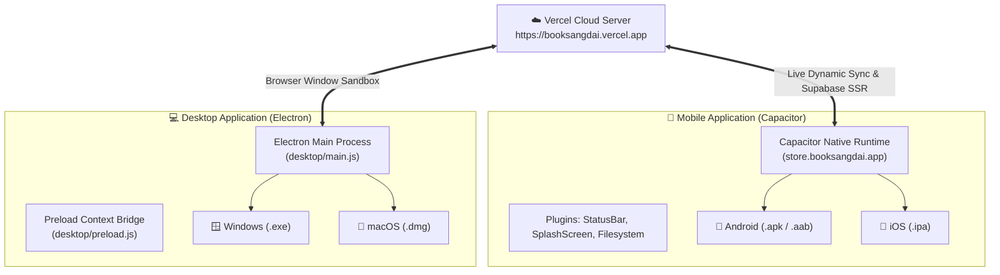

# 📱💻 คู่มือการพัฒนา Mobile App (Capacitor) & Desktop App (Electron) — Book Sangdai

คู่มือแนะนำขั้นตอนการพัฒนาและทดสอบแอปพลิเคชันมือถือ (iOS / Android) ด้วย **Capacitor** และแอปเดสก์ท็อป (Windows / macOS / Linux) ด้วย **Electron** โดยเชื่อมต่อกับโดเมนหลัก **`https://booksangdai.vercel.app`** ของ Book Sangdai

---

## 🏗️ โครงสร้างสถาปัตยกรรม (Architecture Overview)



---

## 💻 1. เดสก์ท็อปแอป (Electron Desktop App)

ไฟล์คอนฟิกหลักอยู่ที่:
- `desktop/main.js` (Main Process ควบคุมหน้าต่าง, เมนู, ลิงก์ภายนอก)
- `desktop/preload.js` (Context Bridge ปลอดภัยสูง)

### 🚀 วิธีรัน Desktop App บนเครื่องทันที:
เปิด Terminal แล้วรันคำสั่ง:
```bash
npm run desktop
```
> **หมายเหตุ:** โปรแกรมจะเปิดหน้าต่างแอปขนาด 1366x860 พื้นหลังสีดำโมเดิร์น `#0a0a0c` และโหลด `https://booksangdai.vercel.app` ทันที พร้อมเมนูภาษาไทยและการจัดการความปลอดภัย

### ⚙️ ตัวเลือกการรันโหมด Development (ทดสอบกับ Localhost 3000):
หากต้องการทดสอบกับโค้ดเครื่องตัวเอง (Local Next.js):
```powershell
$env:ELECTRON_DEV="1"; npm run desktop
```

### 📦 การแพ็กเป็นไฟล์ติดตั้ง (.exe / .dmg):
สามารถใช้ `electron-builder` สำหรับคอมไพล์เป็นไฟล์ติดตั้งแจกจ่ายให้ผู้ใช้ได้:
```bash
npx electron-builder --win   # สร้างตัวติดตั้ง Windows .exe
npx electron-builder --mac   # สร้างตัวติดตั้ง macOS .dmg
```

---

## 📱 2. โมบายล์แอป (Capacitor Mobile App)

ไฟล์คอนฟิกหลักอยู่ที่:
- `capacitor.config.ts` (กำหนด App ID: `store.booksangdai.app`, Server URL: `https://booksangdai.vercel.app`)

### 🤖 ขั้นตอนสำหรับ Android:
1. **สร้างโฟลเดอร์โปรเจกต์ Android Native:**
   ```bash
   npm run cap:add:android
   ```
2. **ซิงค์โค้ดและคอนฟิกล่าสุด:**
   ```bash
   npm run cap:sync
   ```
3. **เปิดใน Android Studio เพื่อคอมไพล์เป็น APK:**
   ```bash
   npm run cap:open:android
   ```
   > ใน Android Studio: ไปที่เมนู `Build` > `Build Bundle(s) / APK(s)` > `Build APK(s)` เพื่อนำไฟล์ `.apk` ไปติดตั้งบนมือถือ Android หรือทดสอบบน Emulator ได้ทันที

### 🍎 ขั้นตอนสำหรับ iOS (ต้องทำบน macOS ที่มี Xcode):
1. **สร้างโฟลเดอร์โปรเจกต์ iOS Native:**
   ```bash
   npm run cap:add:ios
   ```
2. **ซิงค์คอนฟิก:**
   ```bash
   npm run cap:sync
   ```
3. **เปิดใน Xcode:**
   ```bash
   npm run cap:open:ios
   ```

---

## 🌟 ข้อดีของการใช้ Live Server URL (`https://booksangdai.vercel.app`)
1. **Instant Updates (Over-The-Air):** เมื่อแก้ไขฟีเจอร์หรือดีไซน์เว็บแล้ว Push ขึ้น Vercel ทั้ง Mobile App และ Desktop App จะอัปเดตตามทันทีโดยอัตโนมัติ ผู้ใช้งานไม่ต้องกดอัปเดตแอปผ่านสโตร์
2. **Single Codebase:** ฟังก์ชันทุกอย่าง ไม่ว่าจะเป็นการสั่งซื้อ, ตะกร้าสินค้า, สแกนสลิป PromptPay, ระบบคลัง My Library, PDF Reader, และ Merchant Portal สามารถทำงานร่วมกันอย่างไร้รอยต่อ
3. **Zero Maintenance:** ไม่ต้องคอยดูแล API และ Frontend แยก 2 ชุด
