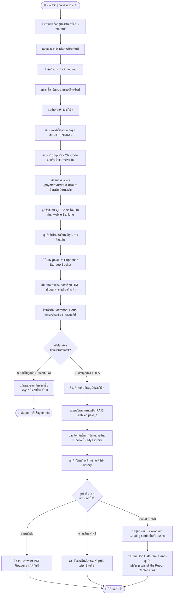
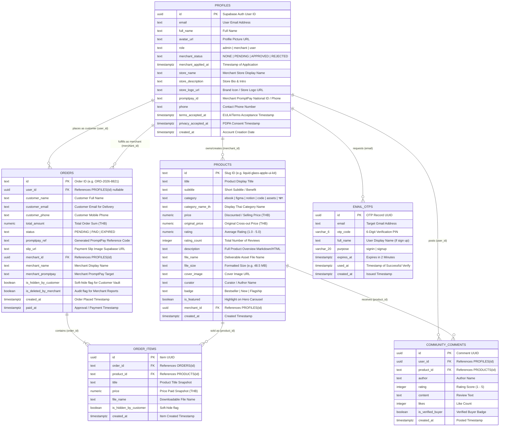
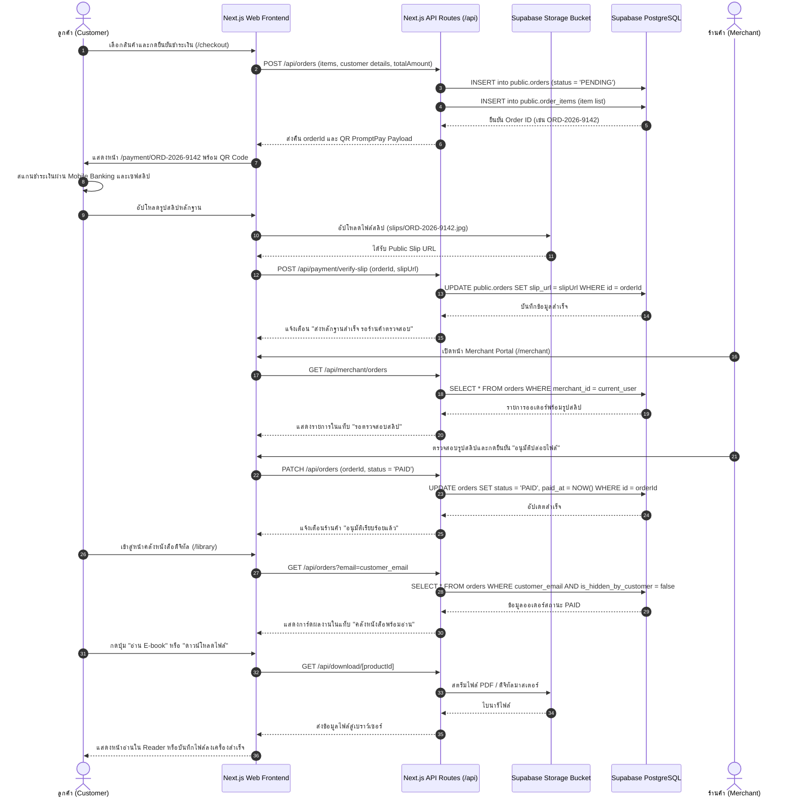
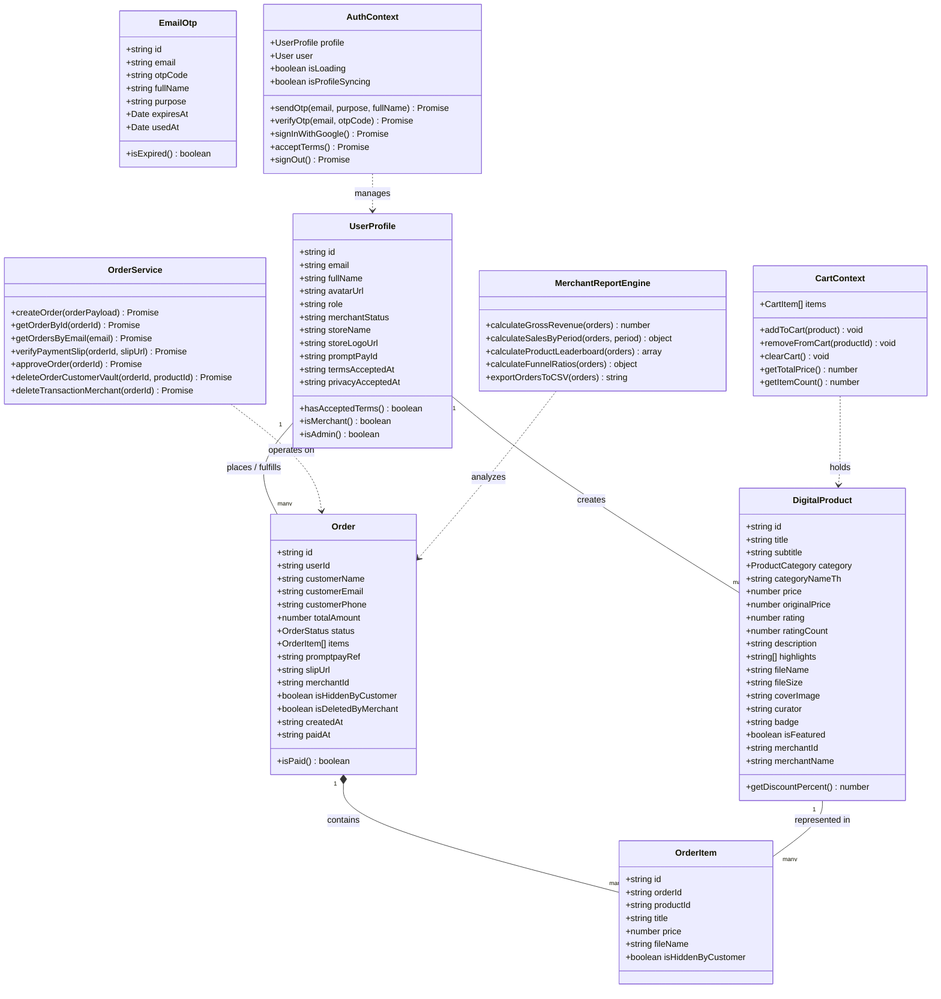
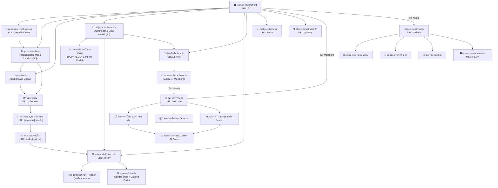

# 📐 Book Sangdai (บุ๊คสั่งได้) — System Architecture & UML Diagrams

เอกสารรวมแผนภาพสถาปัตยกรรมระบบ (UML & System Diagrams) ของแพลตฟอร์ม **Book Sangdai (บุ๊คสั่งได้)** รองรับการทำงานของระบบสั่งซื้อดิจิทัล, คลังหนังสือดิจิทัลส่วนตัว (Digital Vault), ระบบยืนยันตัวตนสองชั้น (Gmail OTP & Google OAuth), การตรวจสอบสลิปโอนเงิน (PromptPay Slip Verification), และศูนย์รายงานสถิติของร้านค้า (Merchant Report Center)

---

## 📑 สารบัญแผนภาพ (Diagram Index)
1. [1. Use Case Diagram (แผนภาพการใช้งานระบบ)](#1-use-case-diagram-แผนภาพการใช้งานระบบ)
2. [2. Activity Diagram (แผนภาพกิจกรรมการทำงาน)](#2-activity-diagram-แผนภาพกิจกรรมการทำงาน)
3. [3. Entity-Relationship (ER) Diagram (แผนภาพความสัมพันธ์ข้อมูล)](#3-entity-relationship-er-diagram-แผนภาพความสัมพันธ์ข้อมูล)
4. [4. Sequence Diagram (แผนภาพลำดับขั้นตอนการทำงาน)](#4-sequence-diagram-แผนภาพลำดับขั้นตอนการทำงาน)
5. [5. Class Diagram (แผนภาพโครงสร้างคลาสและออบเจกต์)](#5-class-diagram-แผนภาพโครงสร้างคลาสและออบเจกต์)
6. [6. Site Map & UI Flow (แผนผังเว็บไซต์และการเชื่อมโยงหน้าจอ)](#6-site-map--ui-flow-แผนผังเว็บไซต์และการเชื่อมโยงหน้าจอ)

---

## 1. Use Case Diagram (แผนภาพการใช้งานระบบ)
แผนภาพแสดงขอบเขตหน้าที่และกรณีการใช้งานของผู้ใช้แต่ละบทบาท (Actors) ได้แก่ **ผู้ซื้อทั่วไป (Buyer / Guest)**, **สมาชิกที่ลงทะเบียน (Registered Member)**, **ร้านค้า (Merchant)**, **ผู้ดูแลระบบ (Super Admin)** และบริการภายนอก (External Services)

```mermaid
flowchart LR
    %% Actors
    subgraph Actors ["👥 ผู้ใช้งานและระบบภายนอก (Actors)"]
        Guest["👤 ผู้เยี่ยมชม / ลูกค้าทั่วไป\n(Guest / Buyer)"]
        Member["🔐 สมาชิกที่ลงทะเบียน\n(Registered Member)"]
        Merchant["🏪 ร้านค้า / ผู้สร้างสรรค์\n(Merchant)"]
        Admin["👑 ผู้ดูแลระบบ\n(Super Admin)"]
        ResendAPI["📧 Resend Email API"]
        SupabaseService["⚡ Supabase Services\n(Auth / DB / Storage)"]
    end

    %% Use Cases Subsystems
    subgraph StorefrontSystem ["🛍️ หน้าร้านและการสั่งซื้อ (Catalog & Checkout)"]
        UC1(["ค้นหาและกรองสินค้าตามหมวดหมู่\n(Browse & Filter Catalog)"])
        UC2(["ดูรายละเอียดสินค้าและส่วนลด\n(View Product & Discounts)"])
        UC3(["เพิ่มสินค้าลงตะกร้า / ซื้อทันที\n(Cart & Direct Checkout)"])
        UC4(["สร้าง PromptPay QR และแนบสลิป\n(PromptPay & Slip Upload)"])
        UC5(["ติดตามสถานะคำสั่งซื้อ\n(Track Order Status)"])
    end

    subgraph AuthSystem ["🔐 การยืนยันตัวตนและนโยบาย (Auth & Consent)"]
        UC6(["สมัครสมาชิก / ขอรหัส OTP\n(Sign Up & Request OTP)"])
        UC7(["เข้าสู่ระบบด้วย OTP 2 นาที\n(Sign In via Gmail OTP)"])
        UC8(["เข้าสู่ระบบด้วย Google OAuth\n(Continue with Google)"])
        UC9(["อ่านข้อตกลง 100% (PDPA & EULA)\n(Consent Reading Gate)"])
        UC10(["จำฉันไว้ในระบบ\n(Remember Me Session)"])
    end

    subgraph VaultSystem ["📚 คลังดิจิทัลส่วนตัว (My Library Vault)"]
        UC11(["ดูคลังสินค้าที่ชำระแล้วและรออนุมัติ\n(View Paid & Pending Vault)"])
        UC12(["อ่าน E-book ในเบราว์เซอร์\n(In-Browser PDF Reader)"])
        UC13(["ดาวน์โหลดไฟล์ดิจิทัลมาสเตอร์\n(Direct Master Download)"])
        UC14(["ลบ E-book ออกจากคลังด้วยรหัสยืนยัน\n(Secure Vault Deletion)"])
    end

    subgraph MerchantSystem ["💼 ระบบร้านค้า (Merchant Portal)"]
        UC15(["ยื่นขอเปิดร้านค้า / ตั้งค่าร้าน\n(Merchant Application & Setup)"])
        UC16(["เพิ่มและจัดการสินค้า 8 หมวดหมู่\n(Product Inventory Management)"])
        UC17(["ตรวจสอบสลิปโอนเงินและอนุมัติออเดอร์\n(Slip Verification & Approval)"])
        UC18(["ดูศูนย์รายงานสถิติยอดขาย (Report Center)\n(Analytics, Funnel & Leaderboard)"])
        UC19(["ลบรายการธุรกรรมด้วยรหัสยืนยัน Order ID\n(Secure Transaction Deletion)"])
        UC20(["ส่งออกข้อมูลธุรกรรมเป็น CSV\n(Export Orders CSV)"])
    end

    subgraph AdminSystem ["⚙️ ระบบผู้ดูแลส่วนกลาง (Admin Portal)"]
        UC21(["ดูภาพรวมรายได้ทั้งระบบ (Platform GMV)\n(Global Dashboard Overview)"])
        UC22(["จัดการร้านค้าและอนุมัติใบสมัคร\n(Store Approvals & Directory)"])
        UC23(["จัดการสิทธิ์และระงับผู้ใช้งาน\n(User Management & Permissions)"])
        UC24(["ตรวจสอบประวัติ Audit Trail และส่งออกข้อมูล\n(Audit Trail & Master CSV Export)"])
    end

    %% Connections
    Guest --> UC1
    Guest --> UC2
    Guest --> UC3
    Guest --> UC4
    Guest --> UC5
    Guest --> UC6

    Member --> UC1
    Member --> UC2
    Member --> UC3
    Member --> UC4
    Member --> UC5
    Member --> UC7
    Member --> UC8
    Member --> UC9
    Member --> UC10
    Member --> UC11
    Member --> UC12
    Member --> UC13
    Member --> UC14
    Member --> UC15

    Merchant --> UC15
    Merchant --> UC16
    Merchant --> UC17
    Merchant --> UC18
    Merchant --> UC19
    Merchant --> UC20

    Admin --> UC21
    Admin --> UC22
    Admin --> UC23
    Admin --> UC24

    UC6 --> ResendAPI
    UC7 --> ResendAPI
    UC4 --> SupabaseService
    UC8 --> SupabaseService
    UC9 --> SupabaseService
    UC12 --> SupabaseService
    UC17 --> SupabaseService
```

---

## 2. Activity Diagram (แผนภาพกิจกรรมการทำงาน)
แผนภาพกิจกรรมแสดงขั้นตอนการทำงานหลักของระบบ ตั้งแต่การเลือกสินค้า, การสร้างคำสั่งซื้อ, การชำระเงิน, การตรวจสลิป, ไปจนถึงการเปิดสิทธิ์ในคลังหนังสือดิจิทัล

---

## 3. Entity-Relationship (ER) Diagram (แผนภาพความสัมพันธ์ข้อมูล)
แผนภาพแสดงโครงสร้างฐานข้อมูลเชิงสัมพันธ์ (PostgreSQL บน Supabase) ของระบบ Book Sangdai พร้อมฟิลด์และคีย์เชื่อมโยง

---

## 4. Sequence Diagram (แผนภาพลำดับขั้นตอนการทำงาน)
แผนภาพแสดงการรับส่งข้อมูลระหว่างส่วนประกอบต่าง ๆ (Frontend, API Route, Supabase Database & Storage, และร้านค้า) ในกระบวนการสั่งซื้อ, การตรวจสลิป, และการดาวน์โหลดไฟล์

---

## 5. Class Diagram (แผนภาพโครงสร้างคลาสและออบเจกต์)
แผนภาพแสดงโครงสร้างข้อมูล (Interfaces & Types), Controllers, Context Providers, และ Services ในโปรเจกต์ Next.js

---

## 6. Site Map & UI Flow (แผนผังเว็บไซต์และการเชื่อมโยงหน้าจอ)
แผนผังโครงสร้างหน้าเว็บ (Page Routes) และการเชื่อมต่อระหว่างหน้าจอ (Navigation & Modal Flows) ในระบบ Book Sangdai

---

## 🛠️ เทคนิคและมาตรฐานการนำไปใช้งาน (Usage & Tooling)
- **เครื่องมือแสดงผล (Rendering Engine):** แผนภาพทั้งหมดถูกเขียนด้วยไวยากรณ์ **Mermaid Markdown** มาตรฐานสากล รองรับการแสดงผลอัตโนมัติบน GitHub, GitLab, VS Code, Antigravity IDE, Notion, Obsidian และเครื่องมือ Markdown Viewers ทั่วไป
- **Single Source of Truth:** แผนภาพทั้ง 6 สอดคล้องกับสถาปัตยกรรมโค้ดจริงของ Next.js 14 App Router, โครงสร้างฐานข้อมูล Supabase PostgreSQL ใน [.ai_docs/04_BACKEND_DATABASE_SQL.md](file:///c:/Users/Phums/.gemini/antigravity/scratch/ebook_shop/.ai_docs/04_BACKEND_DATABASE_SQL.md) และข้อกำหนดระบบใน [.ai_docs/](file:///c:/Users/Phums/.gemini/antigravity/scratch/ebook_shop/.ai_docs/) 100%
